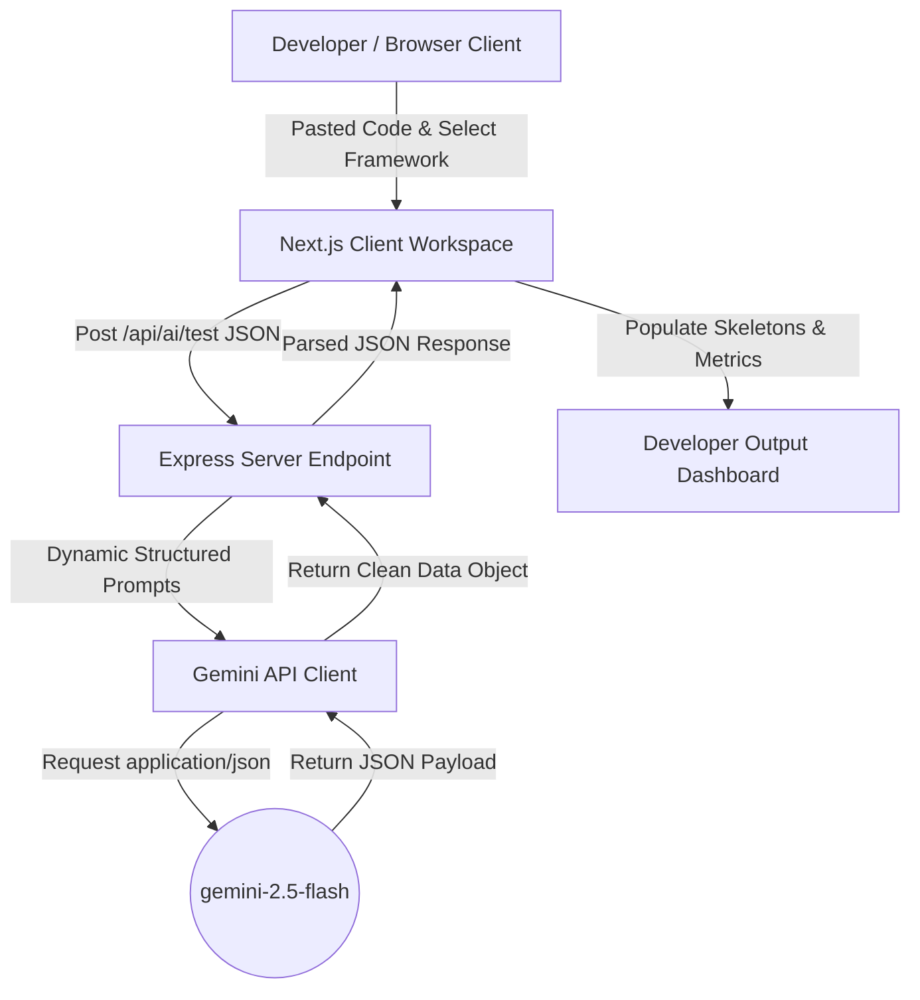

# AI QA Engineer 🚀

An intelligent, developer-centric, AI-powered QA engineering assistant that translates source code (routes, components, controllers, functions) into robust testing suites, executes edge-case scans, details security suggestions, and assigns code risk ratings automatically.

Inspired by the design paradigms of Vercel, Linear, and Cursor.

---

## 📌 The Problem
Manual test generation, edge-case scanning, and vulnerability detection consume valuable engineering hours. Developers frequently write unit tests only for happy paths, neglecting security boundaries, parameter validation flaws, and edge boundary states until they reach staging or production environments.

## 💡 The Solution
**AI QA Engineer** automates test creation and vulnerability scanning directly from the developer workspace. Using generative models, it instantly outputs runnable test blocks, evaluates risk scores, and aggregates actionable edge-case reviews inside a unified, distraction-free developer environment.

---

## 🌟 Key Features

- **Multi-Framework Target Selection**: Supports generating ready-to-run tests for **Jest**, **Pytest**, and **Cypress**.
- **Workspace Code Editor**: Full-featured input code block powered by Monaco Editor.
- **AI Quality & Risk Dashboard**: Instant ratings for *Validation Coverage*, *Security Risk Level*, *Error Resiliency*, and *Test Completeness*.
- **Edge-Cases & Abuse Vulnerabilities**: High-priority lists outlining parameter voids, rate limits, schema holes, and injection threats.
- **One-Click Clipboard Copies**: Direct list copy triggers for easy issue logging.
- **Timestamped File Downloads**: Export complete suites to `.test.js`, `.py`, or `.txt` reports with formatted timestamp tags.
- **Preloaded Demo Datasets**: Load backend Express routes, React form elements, or discount logic modules immediately.

---

## 🛠️ Technology Stack

### Frontend (Client)
- **Framework**: Next.js 16 (App Router)
- **Styling**: Tailwind CSS & Vanilla variables
- **State**: React Hook boundaries (modular components)
- **Editor**: Monaco Editor (`@monaco-editor/react`)
- **Icons**: Lucide React

### Backend (Server)
- **Runtime**: Node.js
- **Framework**: Express.js (ES Modules)
- **Model Client**: Google Generative AI (`@google/generative-ai`)
- **Developer Server**: Nodemon

---

## 📐 Architecture Overview



---

## 🚀 Installation & Local Run

### Prerequisites
- Node.js (v18 or higher)
- npm or yarn
- Gemini API Key ([Google AI Studio](https://aistudio.google.com/))

### 1. Clone & Setup Workspace
```bash
git clone <repository-url>
cd Test-generater
```

### 2. Configure Environment Variables
Create a `.env` file in the `server` directory:
```bash
cp server/.env.example server/.env
```
Open `server/.env` and replace `YOUR_GEMINI_API_KEY_HERE` with your key:
```env
PORT=5001
GEMINI_API_KEY=AIzaSy...
```

### 3. Run Backend Server
```bash
cd server
npm install
npm run dev
```
The server will boot and run on `http://localhost:5001`.

### 4. Run Frontend Client
Open a new terminal tab:
```bash
cd client
npm install
npm run dev
```
The workspace app will start at `http://localhost:3000`.

---

## 🎬 3-Minute Demo Mode Workflow

Follow these steps for a polished live demonstration:

1. **Access Workspace**: Open `http://localhost:3000` in the browser. Note the clean empty state dashboard.
2. **Select Demo Target**: Open the **"Use Demo Example"** drop-down menu in the Monaco header.
3. **Load Code**: Click **"Express Auth Route"** (loads Express JWT code and automatically switches the framework selection to **Jest**). Notice the toast notification confirming the load.
4. **Trigger Generation**: Click **"Generate Suite"**. Skeletons immediately pulse while keeping the page layout stable.
5. **Inspect Ratings**: Review the quality rating badges (e.g. Validation Coverage, Security Risk).
6. **Download Report**: Click the **".js"** button in the Export block. A file like `jest_suite_20260524_1935.test.js` containing tests, edge-cases, and security recommendations is downloaded.

---

## 🔮 Future Roadmap

- **API Specification Uploads**: Drag and drop OpenAPI (`swagger.json`) files to generate integration routes immediately.
- **Git Commit Integrations**: Auto-generate tests in pull requests using GitHub Action hooks.
- **Dynamic Assertions Check**: Test suites compile check before presentation.
